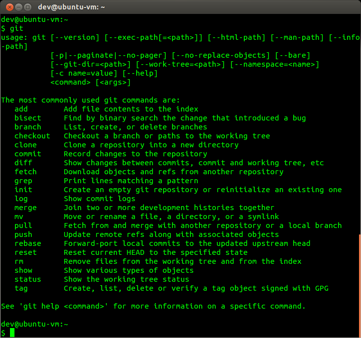
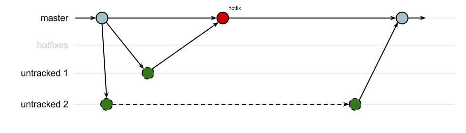
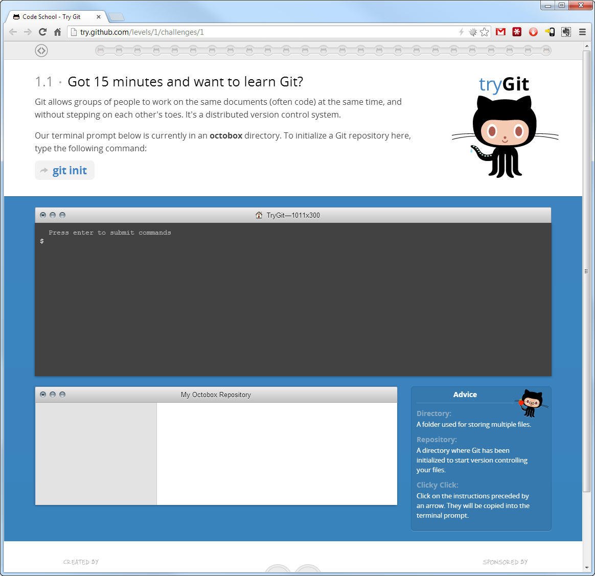
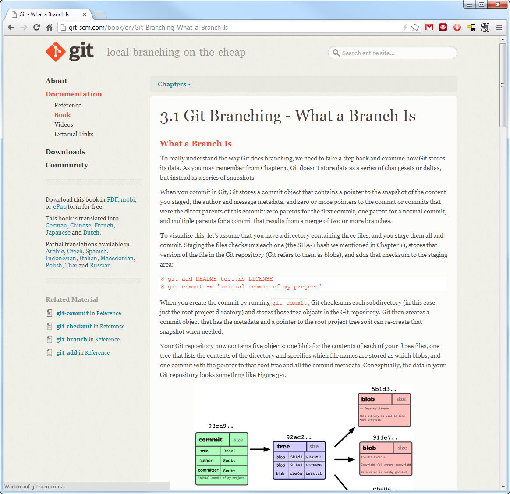

# Distributed Source Code Management with git

An introduction to distributed source code management with git.

---

## Source Code Management / Version Control

---

### What do you want from source code management systems?

- **Experimentation** without risk of loosing data
- **Documentation** of the development process
- Easy **backup**
- Easy **collaboration** with (remote) co-workers
- **No overhead** (file cluttering, file locks, server management)

---

## An overview of git

---

### What is git?

A distributed version control (DVC) and source code management (SCM) system

- A content(!) tracker, not a file tracker.
- A command line tool
- Available for all platforms
- Free and open software
- Leight-weight

---

### The git command-line

Git is a powerful command-line tool you can use on Linux, Mac OS and Windows:

<!-- langauge: lang-sh -->

	$ git

---

### History of git

Developed by Linus Torvalds for the Linux kernel development in 2005 as an replacement for [BitKeeper](http://en.wikipedia.org/wiki/BitKeeper)

---

### Why the name "git"?

git := British slang meaning "a rotten person"

> I’m an egotistical bastard, and I name all my projects after myself. First Linux, now git.”
> - Linus Torvals

---

### Key features of git

- Git does not track single files but a whole filesystem/folder structure by its content
- Git is distributed without a central server
- Every repository contains the complete history
- Git is optimized for rapid branching and merging
- Easy synchronization with other repositories over existing protocols such as http, ftp, rsync or ssh

---

### Distributed Version Control

> Being distributed very much means that you do not have one central
> location that keeps track of your data. No single place is more
> important than any other single place.
> - Linus Torvals

- no central server
- no central repository
- no special permission

---

### How does git cover the things you expect from a SCM?

**Experimenting without loosing changes**

- Git allows you to have multiple experimentation or feature branches which do not interfere with the master branch.
- You can keep your experiments for yourself - your co-workers don't need to know about your experiments if you don't want to

**Documentation**

- Git encourages developers to commit early and often

**Backup**

- Every developer has a full-copy of the repository
- Every repository contains the full history
- Just copy to the repository folder to another location and you are done

**Collaboration**

- Every developer can work on his or her own branch
- Easy exchange of commits
- Branches and even single commits can be easily exchanged and merged

**No overhead**

- All git needs is a ".git" folder in your repository
- Git does not hold file-locks
- Developers don't have do asks for permission before editing a file
- You don't need special infrastructure to exchange commits - all you need is HTTP or SSH

---

### What distinguishes git from centralized SCMs ...

... such as Team Foundation Server or SVN (Apache Subversion):

- no need for a server
- no central database
- no need for permission management
- no special infrastructure
- no need to be afraid of branching and merging

---

### Why do I think we could benefit from using git ?

Branching and merging is so painful for us that we hardly do it.

A **healthy branching strategy** would look something like this:

And opposed to that, this is how our unhealthy branching "strategy" looks like ... because branching and merging is hard:

---

### Other distributed SCMs

- BitKeeper
- Mercurial
- Monotone
- Bazaar

---

## Basics

- SSH Authentication
- How git works

---

## Terminology

- Working Tree
- Commit
- Branch and tags
- Index
- Stash
- .gitignore

---

### Setting up git (on Windows)

- Installation
- Merge Tools
- Configuration
	- Username, Email
	- SSH Keys
	- SSH Identities

---

### Installation

For the installation of git goto [http://git-scm.com](http://git-scm.com) and download the latest version for Windows.

---

### Typical workflows with git

- Managing identities
- Creating a repository
- Cloning a repository
- Comparing Commits
- Working with .gitignore files
	- Tracking a .NET project
- Rebasing a single commit on top of another (Cherry Picking)
	- http://stackoverflow.com/questions/1191282/git-diff-commits-difference
- Creating a branch
- Committing changes
- Undoing commits
- Reverting changes
- Merging conflicts
- Merging branches
- Pushing changes to a remote location
- Rewriting history
- Rebasing Repositories

---

### Tools

- Merge Tools
- Consoles for Windows
	- PowerShell
	- PowerShell + Posh-git
	- ConEmu + PowerShell + Posh-git
- Git UIs

---

### Hosting

- Bitbucket/Github
- Self-Hosting

---

## Useful Resources

---

### Official git website

[Official git website at git-scm.com](http://git-scm.com/)

---

### Tutorials

Github has created a fun online course for learning git:

http://try.github.com

---

### Pro Git eBook

The "Pro Git" eBook is available for free on the git website.

[Pro Git Online](http://git-scm.com/book) / [Pro Git PDF](https://github.s3.amazonaws.com/media/progit.en.pdf)

---

### Videos

- [Google Tech Talk: Linus Torvals on git](http://www.youtube.com/watch?v=4XpnKHJAok8)
- [Git Basics Videos](http://git-scm.com/videos)

---

language: en-US
date: 2013-02-15
tags: Source Code Management, git